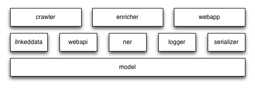

Architecture
============

The overall architecture of PyLSI is shonw as the following figure.

   Fig. Overall architecture of PyLSI

model
-----

This module serves as the shared data model of PyLSI, which defines the classes of media resource, video track and image. It reflects the W3C media ontology. In addition, thi module also provides JSON encoders so as to save instances of media resources into ElasticSearch.

linkeddata
----------

This module implements two functionalities: 1) collecting Linked Data from the Web; 2) finding out related Linked Data resources.

webapi
------

This module encapsulates the functionalities related to Web API and Web service invocation, e.g. lowering, lifting.

ner
---

The ner (Named Entity Recognition) module currently integrates two NER APIs, i.e. Zemanta API and NERD API. It is now used to enrich the meta-data of media resources.

logger
------

Two different types of loggers have been implemented:

- lsilog. It takes advantage of the built-in logging module of Python to generate text-based logs
- nerlogger. It saves NER service invocation results to a Excel spreadsheet

serializer
----------

This module serializes the ElasticSearch query results as RDF triples.

crawler
-------

This module is an executable Python script, which periodically crawls media resources by invoking the Web APIs. The crawled media resources are sent to ElasticSearch.

enricher
--------

This module is an executable Python script, which periodically enrich the metadata of the crawled media resources. It retrieves a video or image from ElasticSearch, then invoke the NER services to enrich its metadata and save the metadata enrichment results back to ElasticSearch.

webapp
------

This module is the Web-based user interface of PyLSI. It is built on top of a framework called web.py, and adopts the MVC pattern.
